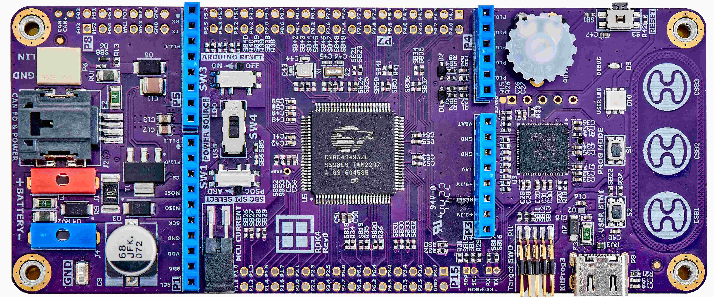

# RDK4 Empty Application

Rutronik Development Kit 4 Programmable System-on-Chip CY8C4149AZE-S598 "RDK4 Empty App" Code Example. 

This example is for creating new ModusToolbox™ project with the RDK4.

## Legal Disclaimer

The evaluation board including the software is for testing purposes only and, because it has limited functions and limited resilience, is not suitable for permanent use under real conditions. If the evaluation board is nevertheless used under real conditions, this is done at one’s responsibility; any liability of Rutronik is insofar excluded. 

